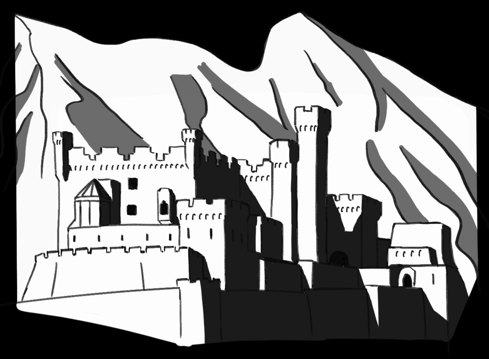
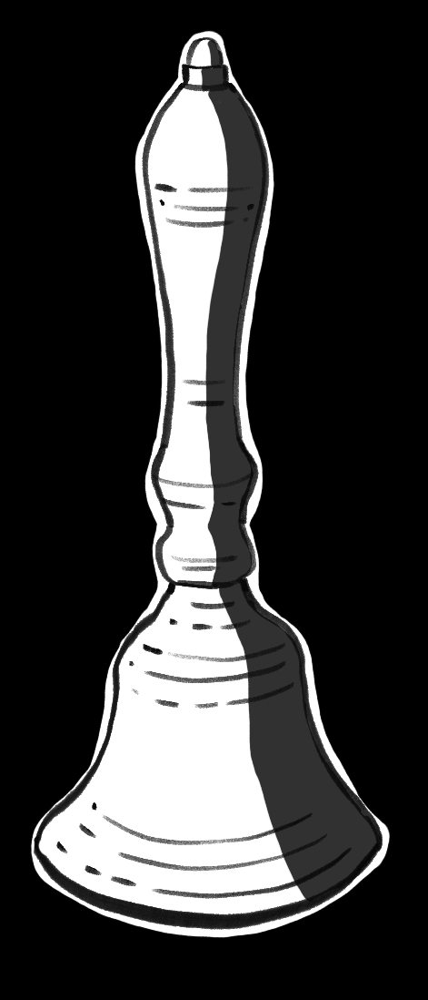
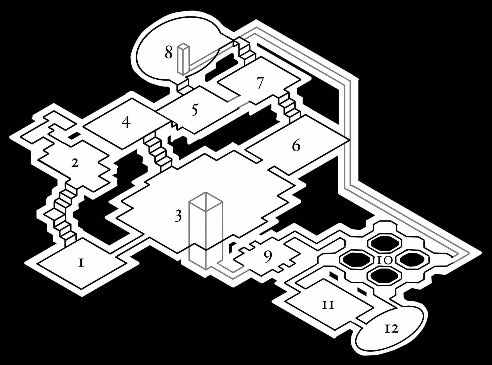
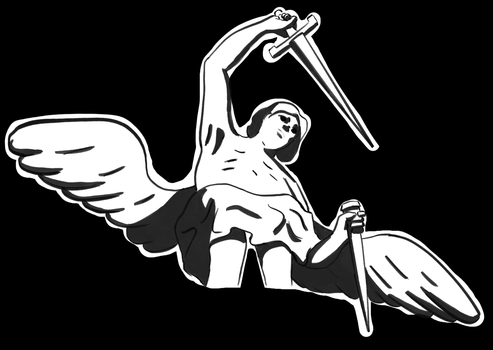
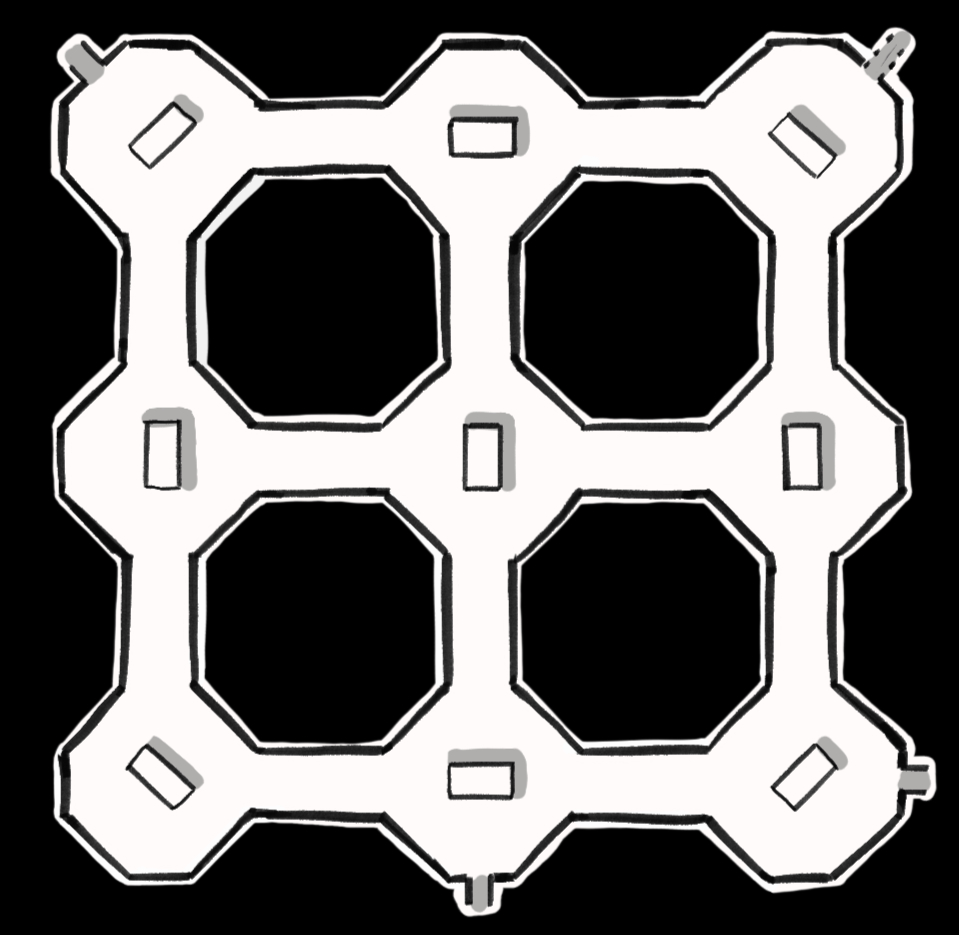
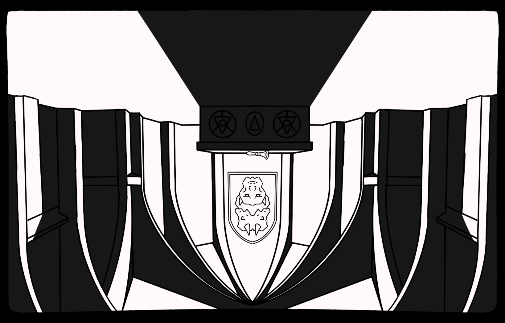

# Feresey

_Feresey es una aventura a contrareloj con una ambientación oscura para personajes de bajo nivel._

El viejo rey Malory teme la guerra. Corren rumores que Lord Hess pretende levantarse en armas. Todo estará perdido si logra el apoyo de Lady Erin, pero la hermana del rey es respetada por la nobleza, a pesar de su conocida afición por las artes oscuras, así que el rey no puede permitirse un enfrentamiento directo.

Ahora bien, unos buscafortunas sin relación con la corona podrían infiltrarse en la fortaleza de Lady Erin y encontrar pruebas en su contra... si es que sobreviven a los horrores que moran tras los muros de Feresey.

## Introducción

Feresey es una aventura para 4 personajes de nivel 3 con una duración de 3 a 4 sesiones. La aventura está diseñada para D&D 5e, pero se puede adaptar a otros sitemas.

Toda la aventura se desarrolla en Feresey, la fortaleza de Lady Erin, donde cada PJ habrá de cumplir un objetivo personal y, uno grupal: obtener pruebas de que Lady Erin conspira contra el rey Malory.

En cuanto lleguen a la fortaleza, las puertas se cerrarán y comenzará una cuentra atrás. Para cumplir sus objetivos, los PJs habrán de gestionar con cuidado todos sus recursos: hechizos, habilidades, descansos, curación... En el proceso, explorarán Feresey y se enfrentarán a sus habitantes.

Cuando la cuenta atrás llegue a su fin, habrán de enfrentarse al terrible Mastín de Sombras de Lady Erin. Será un enfrentamiento cruento, al que tendrán que llegar armados con los muchos artefactos que se pueden encontrar en los rincones de Feresey. De lo contrario, la derrota está asegurada.

## Ambientación

Los humanos dominan el mundo. Las razas de antaño: elfos, enanos, gnomos, incluso orcos y medianos, son rarezas hoy día, y allá por donde van son señalados.

Las viejas religiones han desaparecido, empujadas a la oscuridad por la fulgurane luz del Dios Uno. El culto a sus Tres Rostros se extiende por doquier. Los seguidores más moderados opinan que los antiguos dioses son expresiones del Dios Uno. Los más acérrimos creyentes, creen que son demonios.

## Personajes y Objetivos

Los PJs deben tener nivel 3 o similar para que el escenario resulte un reto.

Opcionalmente, pueden restringirse las razas o clases disponibles. Se recomienda limitar las razas a humanos o semihumanos y las clases a todas aquellas que no dependan exclusivamente de la magia.

A continuación se listan objetivos personales para los PJs. Cada uno puede elegir uno y desarrollarlo como considere oportuno.

- Rescatar a un ser querido de la [Mazmorra](#mazmorra).
- Vengarse del [Enterrador](#enterrador).
- Encontrar un contrato de sangre que afecta a la comunidad del PJ.
- Recuperar la reliquia de San Emil.

Estos objetivos están pensados para explicar las razones que llevan al PJ a aceptar el peligroso encargo del rey Malory y fomentar la exploración de Feresey incluso si el objetivo principal del grupo se considera satisfecho.

## Reglas Específicas

El tiempo de juego estará limitado a:

- 1 descanso largo
- 2 descansos cortos
- 16 cambios de localización

Feresey está compuesta de 12 localizaciones. Solo el [Ala de Huéspedes](#ala-de-huéspedes) es completamente segura. Descansar fuera de ella entraña el riesgo de ser atacados por el [Mastín de Sombras](#mastín-de-sombras).

- Descanso corto: 25% de probabilidad.
- Descanso largo: 95% de probabilidad.

Consulta la sección correspondiente al [Mastín de Sombras](#mastín-de-sombras) para ver los detalles del enfrentamiento.

En cada localización, a excepción del [Ala de Huéspedes](#ala-de-huéspedes), el DM puede iniciar un temporizador de 20 minutos. Este temporizador debe detenerse si se entra en combate, pero se reanudará después. Cuando la cuenta atrás esté próxima a su fin, el DM debe apuntar a la cercanía del [Mastín de Sombras](#mastín-de-sombras). Si la cuenta atrás llega a cero, los PJs serán atacados.

En Feresey hay dos campanas ocultas. Una se encuentra en el [Salón de los Retratos](#salón-de-los-retratos) y otra en el [Templo Invertido](#templo-invertido). Algunas pistas harán pensar a los PJs que deben encontrar estas campanas y tocarlas para impedir el ritual que Lady Erin está llevando a cabo. Sin embargo, si se tocan ambas campanas, se abrirán [Las Puertas del Inframundo](#las-puertas-del-inframundo) y no solo el escenario se considerará fallido, sino que el mundo llegará a su fin.

Si se cumplen todos los objetivos, se abren [Las Puertas del Inframundo](#las-puertas-del-inframundo) o se acaba el tiempo, los PJs serán convocados al [Comedor](#comedor) para el [Final de la Aventura](#final-de-la-aventura).

## La Fortaleza de Feresey

> Feresey, la fortaleza de Lady Erin, es una mole de piedra gris que parece salir de la montaña a su espalda. En torno a sus muros, aldeas y granjas yacen abandonadas y el bosque le gana terreno a las tierras de cultivo año tras año.
>
> Hace frío. El viento bate vuestras ropas de viaje y el cielo amenaza lluvia.
>
> Las puertas de Feresey se abren cuando llamáis y un mayordomo cuya amplia sonrisa deja ver cuantiosas mellas os conduce hacia los aposentos para huéspedes. No hay viajero a quien no se acoja cuando busca refugio, tales son las normas de hospitalidad por estas tierras. Si bien pocos son los viajeros que recalan en Feresey, os dice el mayordomo.
>
> A vuestras espaldas, las puertas se cierran. El mayordomo os informa de que no volverán a abrirse hasta el anochecer del día siguiente. Así mismo, os previene del peligro de alejaros de los aposentos que presenta ante vosotros.
>
> —Muche me temo —dice— que los actuales guardianes de Feresey son excesivamente celosos en la defensa de Lady Erin. En especial, su mastín.
>
> El mayordomo os deja en vuestros aposentos, recordándoos que Lady Erin, al final del día siguiente, os convocará al comedor para conoceros.

Huelga decir que las puertas de Feresey están mágicamente cerradas, y que cualquier ventana a la que los PJs tengan acceso y que de al exterior no podrá ser forzada.

### Ala de Huéspedes

> Cerca de las puertas de Feresey los viajeros pueden hallar solaz. Las estancias son amplias y sus techos, altos. En el aire flota un fuerte aroma a _incienso_. No hay leña con que alimentar las _chimeneas_, y el _servicio_, esquivo y cabizbajo, ofrece mantas polvorientas, pan negro y vino, pero no conversación.

Comunica con el [Jardín](#jardín) y la [Residencia del Servicio](#residencia-del-servicio)

#### Servicio

El servicio se muestra esquivo y temeroso de incurrir en la ira de Lady Erin. Si se les sonsaca, admitirán que otros miembros del servicio han sido arrojados al [Foso](#foso) con anterioridad. Advertirán a los PJs del peligro de adentrarse en Feresey.

#### Chimeneas

Entre las cenizas pueden encontrarse los restos quemados de una nota:

> [...] emisario de Lord Hess [...] Los prisioneros son carne [...]. Encontrad las campanas, os lo ruego.

#### Incienso

Siguiendo el aroma a incienso (Sabiduría CD 10), los PJs pueden llegar hasta una habitación cerrada.

> El olor a incienso no es capaz de ocultar la pestilencia que emana desde el otro lado de la puerta.
>
> La habitación hiede. Los lechos están empapados de un líquido anaranjado y viscoso que hacer llorar los ojos. La alfombra y los tapices han sido desgarrados. En una esquina hay un vial de vidrio con un líquido transparente.

_Sudor de San Wytai_: inflige miedo a una criatura demoníaca durante 3 turnos. 1 solo uso.

En la habitación, el [Mastín de Sombras](#mastín-de-sombras) ha dado muerte a una criatura demoníaca enloquecida, y el servicio apenas ha sido capaz de tapar el hedor quemando incienso.

### Residencia del Servicio

> El ala de Feresey donde reside el servicio es _laberíntica_, pero hogareña y agradable. El aroma a pan inunda sus rincones y se mezcla con el de las flores pudriéndose en jarrones de arcilla. _Doncellas y criados_, en escaso número, recorren los pasillos y se afanan en todo tipo de labores: hilar, amasar, tejer, pulir...

Comunica con el [Ala de Huéspedes](#ala-de-huéspedes).

#### Laberinto

Los PJs encontrarán difícil orientarse entre habitaciones, talleres, despensas y almacenes, pero pueden encontrar las cocinas, de la que proceden extraños gruñidos. Allí, un carnicero se afana en descuartizar una criatura con aspecto de cerdo y rasgos humanos. El cocinero desconoce su procedencia, pero afirma que la carne es dulce y sabrosa.

#### Doncellas y Criados

El servicio se muestra retraído y temeroso. Antes eran maś, pero Lady Erin es severa y castiga toda falta. O al menos, solía hacerlo, pues hace tiempo que no la ven. Ahora es su mastín el que se pasea por Feresey, y conviene no encontrárselo.

Una doncella solicitará la ayuda de los PJs para curar la enfermedad que aflige a su primo. Este está postrado en cama, con una herida infectada en la pierna. Dice haberse aventurado a través del [Jardín](#jardín) hacia la [Mazmorra](#mazmorra), y allí haber sido atacado, pero no conseguirán sonscarle más información. Si lo ayudan, la doncella recompensará a los PJs.

_Pañuelo élfico_: protege a su portador de las miasmas del [Foso](#foso).

### Jardín

> La mole de piedra de Feresey se abre al cielo en un cuidado jardín de aire fresco y rumor de _fuentes_. Amapolas, rosas y claveles se mezclan con árboles frutales en los parterres. Aquí y allá hay _estatuas_ de clérigos piadosos, héroes laureados y penitentes. El suelo en el centro del jardín está decorado con un enorme _mosaico_.

Comunica con el [Ala de Huéspedes](#ala-de-huéspedes), la [Biblioteca](#biblioteca) y el [Templo](#templo). A través del un pasadizo secreto bajo el [Mosaico](#mosaico), se puede acceder a la [Mazmorra](#mazmorra).

#### Fuentes

> Las hay pequeñas y toscas, escondidas entre arbustos o en recónditos claros, pero hay una que llama poderosamente la atención. Una estaua de un ser andrógino y alado señala con una espada una **piedra azul** que sobresale del fondo de la poza. A pesar de que el agua mana sin cesar de los ojos de la estatua, la superficie del agua permanece inalterable.

Si los aventureros simplemente meten la mano para coger la piedra, la estatua alada y otras dos en el jardín cobrarán vida y atacarán.

**Nota para el DM**: No hay una solución concreta al puzle. Si los jugadores dan con una manera interesante de coger la piedra, déjales hacerlo.

| Ángel                                                                                              |
| -------------------------------------------------------------------------------------------------- |
| _Criatura demoníaca_                                                                               |
| **CA**: 14                                                                                         |
| **PG**: 45                                                                                         |
| **FUE**: 14 (+2) **DES**: 11 (0) **CON**: 16 (+3) **INT**: 6 (-2) **SAB**: 16 (+3) **CAR**: 9 (-1) |
| **Espada de piedra**: _ataque cuerpo a cuerpo_. +5 al ataque. 1d8+2 daño contundente.              |

#### Estatuas

> Las hay de caballeros y damas armadas, de clérigos, animales y penitentes. La estatua de un hombre encapuchado sostiene en el puño cerrado una **piedra roja**. Con la otra mano señala la estatua quebrada de una novicia, en cuyo pecho rojo brilla una **piedra blanca**.

Si los PJs tocan la **piedra roja** en la mano de la figura encapuchada, un gas nocivo emanará de los ojos de la estatua, provocando 1d8 de daño venenoso, o la mitad si superan una Tirada de Salvación de Constitución CD 12. Si no superan la tirada, quedarán envenenados hasta el siguiente descanso corto.

| Estatua Animada                                                                                                  |
| ---------------------------------------------------------------------------------------------------------------- |
| _Constructo_                                                                                                     |
| **CA**: 18                                                                                                       |
| **PG**: 18                                                                                                       |
| **FUE**: 14 (+2) **DES**: 11 (0) **CON**: 13 (+1) **INT**: 1 (-5) **SAB**: 3 (-4) **CAR**: 1 (-5)                |
| Resistente a los daños cortante y perforante.                                                                    |
| Vulnerable al daño contundente.                                                                                  |
| **Puño de piedra**: _ataque cuerpo a cuerpo_. +4 al ataque. 1d6+2 daño contundente.                              |
| **Presa**: _ataque cuerpo a cuerpo_. Requiere una Tirada de Salvación de Destreza CD 12 para no quedar agarrado. |

Entre los restos de una de las estatuas puede encontrarse:

_Mixtura de plata_. Puede aplicarse a un arma cuerpo a cuerpo. 2 aplicaciones. Cada aplicación dura 3 ataques. Añade +1 al daño.

#### Mosaico

> Conformado por piedras de colores, cuando se observa desde un determinado ángulo muestra los Tres Rostros del Dios Uno. A cada uno de ellos le falta un ojo.

El Rostro de la Virtud tiene un ojo blanco. La **piedra azul** completa el ojo restante.

El Rostro de la Corrupción tiene un ojo azul. La **piedra roja** completa el ojo restante.

El Rostro del Destino tiene un ojo rojo. La **piedra blanca** completa el ojo restante.

Una tirada de Religión CD 12 recordará a los PJs que los ojos de los rostros del Dios Uno son de diferente color.

Si los PJs colocan correctamente las piedras, el mosaico se vuelve traslúcido, dejando ver unas escaleras que descienden hacia la [Mazmorra](#mazmorra).

Si se equivocan, la última piedra estalla. Todos los PJs que se encuentren cercan deben realizar una Tirada de Salvación de Destreza CD 14 y sufrir 1d6 de daño perforante, o la mitad si superan la tirada. El PJ que puso la última piedra, si falla la tirada de salvación, queda ciego hasta el siguiente descanso largo.

### Biblioteca

> Las _estanterías_ de la biblioteca zizaguean por las paredes, mostrando los descoloridos lomos de tomos aburridos: tratados sobre derecho, usos y costumbres de comarcas remotas o linajes de familias de nombre olvidado. Una luz blanquecina alumbra la estancia y el polvo en suspensión casi se puede masticar. Frente a la gran mesa que preside la sala, el _bibliotecario_ ojea un _índice_ ajado.

Comunica con el [Jardín](#jardín) y el [Observatorio](#observatorio).

#### Estanterías

Todos los libros son completamente inútiles para los aventureros. Entre los huecos de tomos ausentes pueden encontrar pequeñas tiras de papel en la que se lee:

> El que daña a los libros se daña a sí mismo.

#### Índice

> Sobre la mesa que domina la estancia hay un libro abierto que lista los títulos de la biblioteca. Múltiples páginas han sido arrancadas.

Los PJs podrán descubrir que los libros cuyas páginas han sido arrancadas están relacionados con magia y religión.

En el índice hay una sección dedicada a _Contratos y Textos Legales_. En ella se menciona el **Contrato de Sangre**, objetivo de uno de los PJs. Sin embargo, el contrato no se encuentra en las estanterías, sino en posesión del [bibliotecario](#bibliotecario).

### Bibliotecario

Se trata de un demonio con apariencia humana. Su piel es amarillenta y suda copiosamente mientras repite una letanía en voz baja:

> No hay conocimiento prohibido, solo mentes incapaces. El que daña a los libros se daña a sí mismo.

Está furioso por la destrucción del índice a manos de Lady Erin, y teme por la suerte que hayan corrido los libros desaparecidos. Es incapaz de pronunciar en voz alta los títulos, aunque quiera.

Si los PJs dañan cualquier tomo en su presencia, se transformará en un remolino de tinta aullante y los libros se lanzarán cual enjambres de insectos sobre los PJs. En total, los PJs combatirán 4 enjambres.

El bibliotecario custidia en su persona el **Contrato de Sangre**, objetivo de uno de los PJs. Bajo ningún concepto aceptará entregarlo libremente.

Al ser derrotado en combate el bibliotecario, cualquier enjambre de libros que siguiese activo cae al suelo, inerte. Entre los restos del bibliotecario, además del **Contrato de Sangre**, encontrarán un pergamino.

_Pergamino de sanación_: cura 1d6 puntos de golpe a todas las criaturas en un radio de 30 pies. Solo puede utilizarlo un PJ con aptitudes mágicas. 1 solo uso.

| Bibliotecario                                                                                                                  |
| ------------------------------------------------------------------------------------------------------------------------------ |
| _Criatura demoníaca_                                                                                                           |
| **CA**: 8 (+1 por cada enjambre de libros en juego)                                                                            |
| **PG**: 50                                                                                                                     |
| **FUE**: 1 (-5) **DES**: 14 (+2) **CON**: 10 (0) **INT**: 12 (+1) **SAB**: 11 (0) **CAR**: 17 (+3)                             |
| Vulnerable al fuego                                                                                                            |
| Cuando es derrotado, los enjambres de libros activos quedan inertes.                                                           |
| **Alarido**: _ataque de zona_. 30 pies de radio. Requiere una Tirada de Salvación de Constitución CD 12. 1d6 de daño psíquico. |
| **Toque necrótico**: _ataque cuerpo a cuerpo_. +3 al ataque. 1d6+2 de daño necrótico.                                          |

| Enjambre de libros                                                                                                                                                                                                                                                                                                                                                                    |
| ------------------------------------------------------------------------------------------------------------------------------------------------------------------------------------------------------------------------------------------------------------------------------------------------------------------------------------------------------------------------------------- |
| _Constructo_                                                                                                                                                                                                                                                                                                                                                                          |
| **CA**: 10                                                                                                                                                                                                                                                                                                                                                                            |
| **PG**: 15                                                                                                                                                                                                                                                                                                                                                                            |
| **FUE**: 16 (+3) **DES**: 12 (+1) **CON**: 13 (+1) **INT**: 2 (-4) **SAB**: 10 (0) **CAR**: 5 (-3)                                                                                                                                                                                                                                                                                    |
| Vulnerable al fuego                                                                                                                                                                                                                                                                                                                                                                   |
| Cuando un enjambre de libros es derrotado, la CA del þ[Bibliotecario](#bibliotecario) se reduce en 1.                                                                                                                                                                                                                                                                                 |
| **Cortes de papel**: _ataque cuerpo a cuerpo_. +5 al ataque. 1d6+1 daño cortante. Tirada de Salvación de Destreza CD 12 para no ser envuelto por libros. El enjambre atacará exclusivamente al PJ al que envuelva, con ventaja. El PJ debe superar una Tirada de Salvación de Fuerza CD 13 para liberarse del enjambre. Mientras esté envuelto, el PJ se considera agarrado y cegado. |

### Observatorio

> El observatorio es una estancia excavada en la roca. A través de una claraboya natural, un gran _telescopio_ apunta al exterior. En el resto de la sala hay mesillas con libros abiertos y un _atril_ en un extremo, frente a un _mapa celeste_. Una _figura_ gruesa y resollante camina pesadamente por la sala. Despide un olor avinagrado y su tobillizo izquierdo está sujeto por una cadena al telescopio.

Comunica con la [Biblioteca](#biblioteca), el [Estudio de Lady Erin](#estudio-de-lady-erin) y, a través de un pasadizo secreto inaccesible desde este lado, con el [Salón de los Retratos](#salón-de-los-retratos).

#### Astrónomo

El astrónomo tiene el rostro cubierto de sombras. Sus ojos brillan como dos piedras candentes. Es un demonio menor, esclavizado por Lady Erin.

Tratará de convencer a los PJs de que lo liberen. A pesar de que conoce los planes de Lady Erin, se mostrará reacio a colaborar con los PJs. La llave para abrir el cerrojo que lo mantiene prisionero se encuentra en el [atril](#atril)

Liberado de la cadena que lo ata al telescopio, el astrónomo atacará de inmediato a los PJs. Si los PJs averiguan su verdadero nombre, Zweig, el astrónomo se mostrará dócil, si bien no tiene por qué responder sus preguntas.

El astrónomo sabe que, con el ritual, Lady Erin planea abrir [Las Puertas del Inframundo](#las-puertas-del-inframundo). Gracias a sus observaciones, sabe que el tiempo para llevar a cabo el ritual es propicio.

También sabe que Lady Erin deambula por Feresey en forma del [Mastín de Sombras](#mastín-de-sombras).

Por último, sabe que _tañer las dos campanas de bronce que se ocultan en la fortaleza iniciará la apertura de [Las Puertas del Inframundo](#las-puertas-del-inframundo)_.

| Astrónomo                                                                                                                                                           |
| ------------------------------------------------------------------------------------------------------------------------------------------------------------------- |
| _Criatura demoníaca_                                                                                                                                                |
| **CA**: 17                                                                                                                                                          |
| **PG**: 112                                                                                                                                                         |
| **FUE**: 10 (0) **DES**: 10 (0) **CON**: 16 (+3) **INT**: 16 (+3) **SAB**: 14 (+2) **CAR**: 16 (+3)                                                                 |
| Resistente a todo daño no mágico o de armas que no sean de plata.                                                                                                   |
| Inmune al fuego.                                                                                                                                                    |
| **Garras**: _ataque cuerpo a cuerpo_. +6 al ataque. 1d6 daño cortante.                                                                                              |
| **Mirada hirviente**: _ataque a distancia_. +4 al ataque. 1d4+1 de daño de fuego.                                                                                   |
| **Crear astro**: 1 acción. Invoca una esfera ardiente en la habitación. Hasta 4 al mismo tiempo. Por cada astro en juego, el astrónomo tiene 1 turno más por ronda. |

| Astro                                                                                                                                                                                  |
| -------------------------------------------------------------------------------------------------------------------------------------------------------------------------------------- |
| _Constructo_                                                                                                                                                                           |
| **CA**: 10                                                                                                                                                                             |
| **PG**: 10                                                                                                                                                                             |
| Inmune al fuego                                                                                                                                                                        |
| Al ser destruído, explota. Las criaturas en un radio de 15 pies deben superar una Tirada de Salvación de Destreza CD 12 o sufrir 2d6 de daño de fuego (la mitad si superan la tirada). |

Si los PJs combaten y derrotan al astrónomo, entre sus restos encontrarán:

_Poción de curación_: cura 2d4 puntos de golpe, 1 solo uso.

_5 flechas o saetas con punta de plata_.

_Daga ceremonial de manufactura enana_: daga no mágica +1.

#### Telescopio

El enorme ingenio metálico apunta al cielo a través de una apertura natural en la roca. Mirar a través de él desvela una constelación desconocida, visible en la completa oscuridad, sin importar que sea de día o de noche. Quien la observe habrá de realizar una Tirada de Salvación de Sabiduría CD 10 para no quedar mudo de miedo hasta el siguiente descanso corto.

#### Atril

Sobre el atril hay un libro abierto y cifrado por un código incomprensible. A su lado, está la llave que abre el candado que mantiene prisionero al [astrónomo](#astrónomo). De la llave pende una etiqueta.

La respuesta correcta a este acertijo es Zweig, el verdadero nombre del [astrónomo](#astrónomo).

Si los PJs encuentran la constelación que se puede observar a través del [telescopio](#telescopio) en el [mapa celeste](#mapa-celeste), el texto del libro se volverá legible.

En él se detallan centenares de observaciones astronómicas y se repite una frase una y otra vez:

> El momento es ahora.

En la última página hay un hechizo. Las palabras no resultan comprensibles, pero bajo ellas hay una anotación.

> Para encontrarme en las sombras.

Es necesario estudiarlo durante un descanso corto para poder emplearlo por parte de un PJ con aptitudes mágicas.

El hechizo cuesta 1 acción y saca de fase al [Mastín de Sombras](#mastín-de-sombras).

#### Mapa Celeste

> El mapa es antiquísimo, y la tinta con que se trazaron las diferentes constelaciones y miniaturas que lo adornan está desvaída, apenas legible, pero la hendidura que dejaron sobre la piel que sirve de lienzo es aún reconocible al tacto.

El mapa muestra constelaciones, planetas y cuerpos celestes ajenos al firmamento al que están acostumbrarods los PJs.

Si localizan las estrellas de la constelación que se observa a través del [telescopio](#telescopio) y repasan su contorno con el dedo, esta se iluminará y el texto del libro cifrado del [atril](#atril) se volverá repentinamente comprensible.

### Estudio de Lady Erin

> El estudio de la señora de Feresey es una habitación circular en cuyo centro arde un enorme _fuego_. El calor es sofocante y llena la estancia del hedor a pelo quemado. Al otro lado de la puerta hay un _espejo de plata_ de cuerpo completo, cerca de un _escritorio_ primorosamente ordenado.

Comunica con el [Observatorio](#observatorio) y el [Salón de los Retratos](#salón-de-los-retratos). A través de la trampilla bajo el [fuego](#fuego), hay una pasadizo que lleva a la [Cripta](#cripta).

#### Espejo de Plata

> El espejo es una antigüedad deslustrada, adornado con motivos florales. Su reflejo muestra algo insólito, y es que en él no se ve el fuego que arde en el centro de la sala. En su lugar, puede verse una trampilla en el suelo y, sobre ella, una flecha (o saeta) de punta negra.

#### Fuego

> El fuego arde con virulencia sin que nada parezca alimentarlo. Estar cerca es casi insoportable para el común de los mortales.

El fuego es de naturaleza mágica. Si a los PJs se les ocurre cómo apagarlo, podrán hacerlo, pero los medios convencionales no funcionarán.

Bajo el fuego hay una trampilla que conduce a la [Cripta](#cripta).

Sobre la trampilla hay una flecha (o saeta) de punta negra.

_Flecha con punta de obsidiana_: si impacta contra una criatura demoníaca, inflige 3d6 de daño adicional. 1 solo uso.

#### Escritorio

Sobre el escritorio de Lady Erin hay un diario. Las entradas más antiguas se remontan a años atrás y hablan de su incipiente interés por el Inframundo y las artes oscuras. La señora de Feresey siempre ha sentido rabia por no ocupar el trono, y con el tiempo la misantropía ha ido más allá de maltratar a siervos y vasallos.

Más adelante, Lady Erin habla de cómo ha logrado esclavizar a espíritus demoníacos, de cómo el [Foso](#foso) es clave para abrir [Las Puertas del Inframundo](#las-puertas-del-inframundo), así como de los sacrificios que ha realizado: criados, vasallos y meros viajeros arrojados al abismo.

La última entrada dice así:

> Las campanas deben permanecer ocultas. El emisario de Lord Hess a punto estuvo de tañirlas y dar al traste con todo. Esos idiotas no entienden que no es al rey Malory a quien deben temer.

Entre los cajones del escritorio, los PJs encontrarán:

_Vial de antídoto_: cura el envenenamiento. 1 solo uso.

_Tintura de plata_: aplicable a un arma de combate cuerpo a cuerpo. Dura 3 ataques.

### Templo

> Los Tres Rostros del Dios Uno presiden la nave, húmeda y fría. Virtud, con sus ojos blanco y azul. Corrupción, con sus ojos azul y rojo. Y Destino, con sus ojos rojo y blanco.
>
> La _sacerdotisa_, una mujer enjuta, con el rostro cubierto por un velo, se flagela frente a los Tres Rostros. En una de las paredes hay un enorme _tapiz_ que muestra una procesión de animales conducida a un foso mientras dos sacerdotes tañen campanas, una en las alturas y la otra, invertida, en las profundidades. En la pared opuesta al tapiz hay un _relicario_ de marfil y oro.

Comunica con el [Jardín](#jardín) y el [Salón de los Retratos](#salón-de-los-retratos).

#### Sacerdotisa

La sacerdotisa será hostil, pero sin llegar al enfrentamiento físico. Si los PJs se muestran píos y veneran al Dios Uno, insistirá en que expíen sus muchos pecados, como hace ella.

Si le preguntan el motivo de su penitencia, o por Lady Erin, les dirá que la señora de Feresey ya solo observa el rostro de la Corrupción, y que ella, la sacerdotisa, no ha sabido impedirlo.

Si se le pregunta sobre el [tapiz](#tapiz), les contará de la existencia de dos campanas en Feresey, que ella vio cuando era novicia y que Lady Erin protege. Se trata de antiguas reliquias, pero desconoce su función.

#### Tapiz

Si se fijan bien, los PJs descubrirán que los animales de la procesión tienen rasgos humanos, y que al fondo del [Foso](#foso) hay unas puertas.

Tras el tapiz hay un osario abierto. Entre los restos de hueso yace un pergamino y un rosario rojo con los Tres Rostros.

El pergamino dice así:

> Perdóneme el Dios Uno por aquello que ayudé a encontrar, y quiera que las Puertas permanezcan cerradas, a menos que nuestros pecados sean grandes y muchos.

_Rosario de los Tres Rostros_: cada rostro es de un único uso y debe ser aplastado entre los dedos del portador para que surta efecto.

- _Rostro de la Virtud_: provoca 2d4 de daño radiante a todas las criaturas hostiles en un radio de 30 pies alrededor del portador.
- _Rostro de la Corrupción_: resta 2d4 puntos de golpe al portador y los cura a una criatura a su elección en un radio de 30 pies.
- _Rostro del Destino_: De entre todas las criaturas conscientes en un radio de 30 pies alrededor del portador, una al azar ve reducida su vitalidad a 1 punto.

#### Relicario

Es antiguo, y de exquisita manufactura. La sacerdotisa gruñiará al ver a los PJs acercarse.

En el mecanismo de apertura hay una trampa. Desactivarla require una prueba con CD 15. Si un PJ trata de abrir el relicario, deberá pasar una Tirada de Salvación de Constitución CD 12 para no resultar envenenado.

En el interior del relicario encontrarán el siguiente objeto:

_Vértebra de Santa Susanna_: quien la lleve encima recibe ventaja a todos los ataques, pero cualquier impacto recibido se considera crítico a efectos de daño.

### Salón de los Retratos

> Una sala rectangular y en penumbra. Tres de las paredes están cubiertas de _retratos de antiguos guerreros_, armados y amenazantes. En la cuarta pared hay _tres grandes cuadros_ que muestran antiguos señores y señoras de Feresey. En el centro de la sala hay un _arcón_ abierto.

Comunica con el [Templo](#templo), el [Estudio de Lady Erin](#estudio-de-lady-erin) y, a través de un pasadizo secreto, con el [Observatorio](#observatorio).

#### Retratos de Antiguos Guerreros

Hay arqueros, ballesteros, hechiceros y caballeros. Nada en los cuadros parece fuera de lo normal.

Los retratos pueden volverse hostiles (ver [arcón abierto](#arcón-abierto)). De ser así, atacarán desde el interior del cuadro y no se los podrá sacar de ellos.

En total, hay 2 arqueros, 1 hechicero y 2 caballeros.

Los PJs pueden voltear los cuadros y asegurarlos contra la pared para atrapar a sus habitantes dentro.

| Arquero                                                                                             |
| --------------------------------------------------------------------------------------------------- |
| _Constructo_                                                                                        |
| **CA**: 12                                                                                          |
| **PG**: 25                                                                                          |
| **FUE**: 10 (0) **DES**: 15 (+2) **CON**: 10 (0) **INT**: 12 (+1) **SAB**: 14 (+2) **CAR**: 16 (+3) |
| Vulnerable al fuego.                                                                                |
| **Estoque**: _ataque cuerpo a cuerpo_. +4 al ataque. 1d6+2 daño perforante.                         |
| **Arco corto**: _ataque a distancia_. +4 al ataque. 1d6+1 de daño perforante.                       |
| **Ocultarse**: 1 acción adicional. Se oculta en el interior del cuado, no siendo posible atacarle.  |

| Caballero                                                                                          |
| -------------------------------------------------------------------------------------------------- |
| _Constructo_                                                                                       |
| **CA**: 15                                                                                         |
| **PG**: 25                                                                                         |
| **FUE**: 15 (+2) **DES**: 10 (0) **CON**: 13 (+1) **INT**: 7 (-2) **SAB**: 12 (+1) **CAR**: 7 (-2) |
| Vulnerable al fuego.                                                                               |
| **Lanza**: _ataque cuerpo a cuerpo_. +4 al ataque. 1d8+2 daño perforante.                          |

| Hechicero                                                                                           |
| --------------------------------------------------------------------------------------------------- |
| _Constructo_                                                                                        |
| **CA**: 11                                                                                          |
| **PG**: 25                                                                                          |
| **FUE**: 10 (0) **DES**: 12 (+1) **CON**: 13 (+1) **INT**: 12 (+1) **SAB**: 15 (+2) **CAR**: 11 (0) |
| Vulnerable al fuego.                                                                                |
| **Descarga sobrenatural**: _ataque a distancia_. +3 al ataque. 1d10 daño de fuerza.                 |

Cuando se los derrota, dentro del cuado se materializarán los siguientes objetos:

_Vial de antídoto_: cura el envenenamiento. 1 solo uso.

_Pergamino de vuelta a la vida_: debe ser utilizado por un PJ con aptitudes mágicas. Require 1 descanso largo en que el PJ no descansará así como el cuerpo del PJ recién fallecido. Al volver a la vida, el PJ verá todos sus atributos reducidos en 1 y sus puntos de golpe comenzarán a la mitad de su valor base. 1 solo uso.

#### Grandes Cuadros

> Los antiguos señores de Feresey parecen sostener algo, pero sus manos están vacías. En los vestustos marcos hay dos hendiduras, una circular y otra rectangular.

#### Arcón Abierto

Dentro hay seis placas metálicas, tres circulares y tres rectangulares. En la base del arcón hay una inscripción:

> Ay de aquel que no haga como dice.

Las placas circulares dicen así:

- Campana, pero
- Pasaje, pero
- San Emil, pero

Las placas rectangulares dicen así:

- reina el silencio
- se habla sin descanso
- se hace la noche

Las placas pueden emparejarse al gusto de los PJs y encajarse en cualquiera de los [grandes cuadros](#grandes-cuadros). Al encajarse, el objeto de la placa circular se revela, pero el efecto de la placa rectangular entra en efecto.

- Cuando usan la placa de pasaje, el retrato de vuelve traslúcido y revela un pasadizo hacia el [Observatorio](#observatorio).
- Al usar la placa de San Emil, entre las manos del restrato aparece un pequeño relicario que contiene la **reliquia de San Emil**, objetivo de uno de los PJs.
- Con la placa de la campana, entre las manos del retrato aparece una campana de bronce, una de las dos que deben ser tañidas para abrir [Las Puertas del Inframundo](#las-puertas-del-inframundo), aunque los PJs tal vez sigan pensando que hacerlo detendrá el ritual.

Si tañen la campana, la fortaleza de Feresey se estremecerá, y de las profundidades de la misma se elevará el hondo aullido de cientos de voces.

En el momento en que coloquen las placas, los jugadores deben cumplir con lo requerido por las placas rectangulares.

- _Reina el silencio_ significa que no pueden hablar.
- _Se habla sin descando_, que al menos uno de ellos debe estar constantemente hablando, si bien pueden turnarse para hacerlo.
- _Se hace la noche_, que deben jugar con los ojos cerrados.

Los efectos son acumulativos y deben mantenerse hasta que abandonen la estancia.

Si incumplen los efectos, los [retratos de antiguos guerreros](#retratos-de-antiguos-guerreros) los atacarán sin piedad.

### Mazmorra

> La mazmorra de Feresey es lóbrega. El halo de unas pocas antorchas deja ver las esporas de las _setas subterráneas_ flotando en el aire. Huelen a tierra marchita y a podredumbre. En la apenumbra pueden verse cuatro _jaulas_, dos de ellas habitadas por prisioneros en un estado lamentable. Entre las jaulas, ajena aún a vuestra presencia, se desliza una _masa tentacular_ y viscosa en la que ventosas y ojos se alternan en gran número.

Comunica con el [Jardín](#jardín) a través de un pasadizo oculto bajo el [mosaico](#mosaico) y con la [Cripta](#cripta).

#### Setas Subterráneas

Son levemente iridiscentes y crecen en gran número entre las grietas en la roca. Con tiempo y los materiales adecuados, podría prepararse con ellas un ungüento curativo. Consumidas al natural, pueden resultar peligrosas.

Curan 1d4+1. Requieren una Tirada de Salvación de Constitución CD 13 para no quedar envenenado. 1 uso por PJ.

#### Masa Tentacular

El _carcelero_ es un engendro creado por Lady Erin mediante artes oscuras. Es estúpido y atacará de inmediato a cualquier criatura que encuentre en libertad.

Si lo derrotan, en su interior, cubierta por una sustancia viscosa, encontrarán un arma.

_Hacha del ejecutor_: hacha mágica. Daño cortante. Versátil. +1 (1d8+1) a una mano, +2 (1d10+2) a dos manos. Cada golpe hiere al portador por 1d4-1 de daño.

| Carcelero                                                                                                                                                                                                      |
| -------------------------------------------------------------------------------------------------------------------------------------------------------------------------------------------------------------- |
| _Aberración_                                                                                                                                                                                                   |
| **CA**: 16                                                                                                                                                                                                     |
| **PG**: 115                                                                                                                                                                                                    |
| **FUE**: 19 (+4) **DES**: 10 (0) **CON**: 16 (+3) **INT**: 5 (-3) **SAB**: 11 (0) **CAR**: 5 (-3)                                                                                                              |
| Inmune al veneno                                                                                                                                                                                               |
| Visión en la oscuridad.                                                                                                                                                                                        |
| **Tentáculos**: _ataque cuerpo a cuerpo_. +6 al ataque. 2d6+4 daño contundente.Tirada de Salvación de Destreza CD 14 para no quedar apresado.                                                                  |
| **Apretar**: acción adicional sobre ciatura apresada. Tirada de Salvación de Constitución CD 13 para no quedar paralizada durante 3 turnos. Cuando el PJ queda paralizado, el carcelero lo suelta en el suelo. |

#### Jaulas

> Las jaulas son de hierro, negras, tan estrechas que no permiten a los prisioneros sentarse, y tan bajas que no pueden ponerse de pie. Frente a cada una hay una palanca. Dos de ellas tinen una cinta roja. Las otras, una cinta blanca.
>
> Una de las jaulas con cinta roja está abierta, y la palanca frente a ella, bajada. En la jaula hermana, unas púas metálicas han salido del propio suelo y ensartado a su anterior ocupante, del que solo queda un esqueleto.

Dentro de una de las jaulas con cinta blanca está el **personaje al que uno de los PJ ha venido a rescatar**. En la otra hay una criada anciana y ciega, de nombre Erika, con los labios cuarteados por la sed.

Si los PJs tiran de la palanca frente a la celda del prisionero, lo librerán, pero Erika será ensartada por las púas. Si tiran de la palanca de Erika, el prisionero morirá.

Los prisioneros no están en condiciones físicas de acompañar a los PJs durante su aventura, así que tendrán que decidir qué hacer con ellos. Dejarlos en el [Ala de Huéspedes](#ala-de-huéspedes) es una opción.

### Cripta

> El olor a descomposición y a incienso se mezcla en los estrechos pasillos de la cripta. Teas ardientes, guarecidas tras rejas negras, alumbran las salas octogonales que la conforman. En el centro de cada sala hay un _sarcófago de piedra_ blanca. Sobre cada uno, reposan los restos del _guardián_ que, en vida, protegió al señor o señora de Feresey que hoy reposa en el féretro. Un _hombre_ alto y de pelo ralo, con las uñas negras y sonrisa ladina, se pasea entre las salas, tocándolo todo.

Comunica con la [Mazmorra](#mazmorra), el [Templo Invertido](#templo-invertido), el [Foso](#foso) y, a través de un pasadizo secreto accessible solo dede el otro lado, con el [Estudio de Lady Erin](#estudio-de-lady-erin).

#### Enterrador

El enterrador es un hombre enloquecido, obesionado con la muerte pero temeroso de ella.

El **objetivo personal** de uno de los PJs es vengarse del enterrador.

En el interior de tres sarcófagos ha escondido filacterias con fragmentos de su alma. Hasta que dichas filacterias no sean destruídas, el enterrador no puede ser dañado por ninǵun medio.

| Carcelero                                                                                            |
| ---------------------------------------------------------------------------------------------------- |
| _Humanoide_                                                                                          |
| **CA**: 12                                                                                           |
| **PG**: 9                                                                                            |
| **FUE**: 11 (0) **DES**: 12 (+1) **CON**: 10 (0) **INT**: 10 (0) **SAB**: 11 (0) **CAR**: 10 (0) (3) |
| Invulnerable a todo daño hasta que las 3 filacterias sean destruídas.                                |
| Ventaja en tiradas de salvación contra encatando o asustado.                                         |
| **Multiataque**: el enterrador realiza dos ataques con el martillo en su turno.                      |
| **Martillo**: _ataque cuerpo a cuerpo_. +3 al ataque. 1d6 daño contundente.                          |

#### Sarcófagos de Piedra

> Los sarcófagos, así como sus tapas, son de piedra maciza, blanca y lisa. En su interior reposan los restos de antiguos señores y señoras de Feresey, que fueron enterrados junto a algunos de sus objetos más queridos.

Abrir un sarcófago cuesta 1 acción. Coger un objeto de entre los restos, o destruir una filacteria, cuesta 1 acción.

En total, hay 7 objetos útiles repartidos entre los 9 sarcófagos. En cada sarcófago habrá, a lo sumo, un objeto.

- _Poción de curación_: cura 2d4.
- _Moneda del destino_: permite volver a realizar una tirada, de cualquier tipo. 1 solo uso.
- _Jabalina de Santa Alba_: su punta de cristal contiene un líquido dorado. Saca de fase al [Mastín de Sombras](#mastín-de-sombras) durante 1d4 turnos. 1 solo uso.
- _Tiara del Buen Ladrón_: +1 a las tiradas de sigilo.
- _Filacteria_: un vial de cristal con un humo rojizo flotando en su interior. Hay 3 filacterias escondidas entre los sarcófagos.

#### Guardián

> Los guardianes, antaño gloriosos caballeros y damas juramentados, son hoy esqueletos embutidos en restos de armadura que aún aferran sus oxidadas armas.

Si un PJ presta especial atención, verá que los esqueletos están animados y en reposo.

Si intentan abrir un sarcófago o si el enterrador se vuelve hostil, 9 guardianes, uno sobre cada sarcófago, se levantarán en armas contra los PJs.

| Guardianes                                                                                        |
| ------------------------------------------------------------------------------------------------- |
| _No muertos_                                                                                      |
| **CA**: 14                                                                                        |
| **PG**: 15                                                                                        |
| **FUE**: 10 (0) **DES**: 14 (+2) **CON**: 15 (+2) **INT**: 6 (-2) **SAB**: 8 (-1) **CAR**: 5 (-3) |
| Inmune al veneno                                                                                  |
| Vulnerable al daño contundente.                                                                   |
| **Espada corta**: _ataque cuerpo a cuerpo_. +4 al ataque. 1d6+2 daño cortante.                    |
| **Arco corto**: _ataque a distancia_. +4 al ataquel. 1d6+2 daño perforante.                       |

### Templo Invertido

> En el corazón de Feresey, aprovechando una oquedad natural de la roca, se ha consagrado un templo. Pero este no es en honor a los Tres Rostros del Dios Uno, sino al Triunvirato del Inframundo, cuyos deformes rostros muestra un enorme _rosetón_, alumbrado por imperecederas llamas. El rosetón, al igual que todo el templo, está invertido. Cuando entráis en él, pisáis el techo del que penden hacia las alturas enormes lámparas. Sobre vuestras cabezas están los bancales y el altar, y entre ellos se mueven parsimoniosas _tres figuras_ ataviadas cual clérigos. Sobre el altar reposa una _campana de bronce_.

Comunica con la [Cripta](#cripta) y el [Foso](#foso).

Las entradas a las otras salas están en el techo por el que los PJs pisan.

Los _clérigos_ son capaces de invertir la gravedad sobre sí mismos a voluntad, gastando la mitad de su movimento en caer desde las alturas o en flotar hacia estas. Además, si impactan con sus armas en un PJ, este verá su gravedad igualmente invertida.

Destruir el rosetón invierte la gravedad de todas las criaturas.

Si los PJs trepan las lámparas y saltan desde la cima de ellas, verán invertida su gravedad. Si, desde las alturas, logran alcanzar las lámparas, también verán invertida su gravedad.

Caer de un extremo a otro del templo provoca 1d6-1 de daño. Si superan una Tirada de Salvación de Destreza CD 10, el daño se reduce a la mitad.

#### Rosetón

> El rosetón tiene el tamaño de un hombre adulto. En colores rojo, amarillo, blanco y negro, muestra los rostros del Triunvirato del Inframundo.

Si se destruye, invierte la gravedad de todas las criaturas.

#### Clérigos

Los clérigos son un sacristán y dos monaguillos demoníacos, ataviados con ropajes rituales. Son incapaces de hablar y se mostrarán hostiles de inmediato.

| Sacristán                                                                                                                                                                               |
| --------------------------------------------------------------------------------------------------------------------------------------------------------------------------------------- |
| _Criatura demoníaca_                                                                                                                                                                    |
| **CA**: 13                                                                                                                                                                              |
| **PG**: 45                                                                                                                                                                              |
| **FUE**: 16 (+3) **DES**: 15 (+2) **CON**: 15 (+2) **INT**: 9 (-1) **SAB**: 11 (0) **CAR**: 11 (0)                                                                                      |
| Resistente al daño físico de armas no mágicas o no de plata.                                                                                                                            |
| Inmune al veneno y al frío.                                                                                                                                                             |
| Visión en la oscuridad.                                                                                                                                                                 |
| Ventaja en tiradas de salvación contra efectos mágicos.                                                                                                                                 |
| **Inciensario de oro**: _ataque cuerpo a cuerpo_. +5 al ataque. 1d10+3 daño cortante. Si impacta, el objetivo ve su gravedad invertida. Consulta [Templo Invertido](#templo-invertido). |

| Monaguillo                                                                                                                                                                                        |
| ------------------------------------------------------------------------------------------------------------------------------------------------------------------------------------------------- |
| _Criatura demoníaca_                                                                                                                                                                              |
| **CA**: 7                                                                                                                                                                                         |
| **PG**: 13                                                                                                                                                                                        |
| **FUE**: 10 (0) **DES**: 5 (-3) **CON**: 11 (0) **INT**: 1 (-5) **SAB**: 11 (0) **CAR**: 3 (-4)                                                                                                   |
| Resistente al frío.                                                                                                                                                                               |
| Inmune al fuego, al veneno, a encantamiento y a asustado.                                                                                                                                         |
| Visión en la oscuridad.                                                                                                                                                                           |
| **Jabalina dorada**: _ataque cuerpo a cuerpo o a distancia_. +3 al ataque. 1d4 daño perforante. Si impacta, el objetivo ve su gravedad invertida. Consulta [Templo Invertido](#templo-invertido). |

Entre los restos del sacristán, encontrarán el siguiente objeto:

_Espada de Santa Águeda_: espada larga +1. De cristal. En caso de pifia, considera un impacto crítico y la espada queda destruída, dañando a su portador por 1d4 puntos de golpe de daño cortante.

Ninguna de las armas de las criaturas demoníacas conservará el poder de invertir la gravedad fuera del [Templo Invertido](#templo-invertido).

#### Campana de Bronce

Una de las dos que deben ser tañidas para abrir [Las Puertas del Inframundo](#las-puertas-del-inframundo), aunque los PJs tal vez sigan pensando que hacerlo detendrá el ritual.

Si tañen la campana, la fortaleza de Feresey se estremecerá, y del cercan [Foso](#foso) se elevará el hondo aullido de cientos de voces.

### Foso

> En las mismas raíces de Feresey se abre un foso inmenso. Como una boca abierta hacia las profundidades, cuyo fondo no se atisba. De la negrura emanan _miasmas_ del color del vómito, que se agarran a la garganta y asfixian. En las paredes rugosas han brotado _rostros_ cuyas cuencas vacías están colmadas de sangre.

Comunica con la [Cripta](#cripta) y el [Templo Invertido](#templo-invertido).

#### Miasmas

Estar en la sala del Foso requiere una Tirada de Salvación de Constitución CD 12. De no superarla los PJs habrán de abandonar de inmediato la estancia o quedar envenenados.

#### Rostros

> Los rostros de roca parecen albergar vida. La sangre en las cuencas de sus ojos se agita sin llegar a derramarse nunca y los labios tiemblan sin que voz alguna pueda manar de sus gargantas de piedra.

Los rostros saben que Lady Erin arroja al servicio y a viajeros al foso, y que lleva años haciéndolo para alimentarlo. También saben que del foso provienen criaturas demoníacas, y que el ritual para abrir [Las Puertas del Inframundo](#las-puertas-del-inframundo) está a punto de completarse.

#### Agujero

> El foso es inmenso, insondable. De sus profundidades emana un intenso calor. Si se presta atención, pueden escucharse voces provenientes de su interior. Chillidos angustiados. En las rugosas paredes, a unos 40 pies del borde, ha quedado algo prendido, un escapulario con una nota prendida en el cordel.

El escapulario muestra los Tres Rostros del Dios uno y está grabado con el nombre de su dueño, Lord Hess. La nota prendida dice así:

> Tocar las campanas abrirá las puertas.

De ser portado, niega críticos de criaturas demoníacas.

Si un PJ cae a las profundidades del foso, se desgañitará gritando durante casi un minuto antes de estallar en llamas negras y quedar suspendido en el aire, rodeado de otras víctimas como él, todos ardiendo por el resto de la eternidad, su sangre brotando a través de las quemaduras, sin agotarse nunca.

### Comedor

El comedor es una estancia de Feresey que permanece cerrada e inaccesible para los PJs hasta que la aventura llegue a su fin.

> Tras las puertas de ébano, la oscuridad es casi tangible. Sobre una larga mesa engalanada con un mantel de intrincado bordado reposan candelabros de plata pulida. Las llamas de las velas parecen esferas anaranjadas flotando en un océano que se abate y recede, todo a un tiempo. En cuanto ponéis un pie en el interior de la estancia, la humedad empieza a condensarse en una miríada de gotas de rocío sobre vuestras ropas. Al tiempo que las puertas se cierran con un estampido seco, escucháis un gruñido procedente del otro extremo de la sala.

En el comedor se dará el combate definitivo contra el [Mastín de Sombras](#mastín-de-sombras) y los horrores que lo acompañan.

## Mastín de Sombras

> El Mastín de Sombras es un perro de tamaño descomunal, cuyo pelaje negro fluctúa y se convierte en negrura a su alrededor, tan oscura como las profundidades de sus fauces.

El Mastín es el enemigo definitivo de Feresey. Se trata de la propia Lady Erin, así transformada tras sus pactos con el Triunvirato del Inframundo. A pesar de su forma animal, mantiene el uso de la razón y es capaz de comunicarse mentalmente.

El Mastín va acompañado de Horrores, criaturas monstruosas, de carnes inflamadas y enfermas, hambrientas y malignas. Es una de estas criaturas la que los PJs pueden haber visto en la tabla de cortar del cocinero en el [Laberinto](#laberinto).

El Mastín de Sombras atacará a los PJs si permanecen demasiado tiempo en una localización no segura.

Si se enfrentan a él en el comedor, Lady Erin puede optar por conversar con ellos antes de devorarlos. Si los PJs han descubierto que no debían tocar las campanas, y con ello han interrumpido el ritual, Lady Erin estará furiosa. Si, por el contrario, han tañiado ambas campanas y con ello abierto [Las Puertas del Inframundo](#las-puertas-del-inframundo), se mostrará divertida y, tal vez, solo tal vez, puedan convencerla de no devorarlos.

El enfrentamiento con el mastín se producirá en un plano diferente. Al comienzo del combate, los PJs se verán transportados a un espacio vacío, cubierto de sombras por doquier excepto en un círculo de 60 pies de diámetro. El mastín irá acompañado de 1d4+1 horrores.

Tal vez aún no sea el momento de enfrentarse al mastín. Los PJs pueden haber permanecido demasiado tiempo en una estancia, o haberse visto sorprendidos durante un descanso. Tal vez el DJ simplemente quiera que la aventura no acabe aún. En tal caso, existe la posibilidad de huída por parte de los PJs, pero no será sencilla. Tras la primera ronda, una vez por ronda, se ofrecerá un pacto a uno de los PJs, según el objetivo personal de cada uno, pero solo si han completado dicho objetivo. Aceptar dicho pacto permitirá a todos los PJs regresar a la estancia de Feresey en que se encontraban antes de enfrentarse al mastín. Si no aceptan ninguno de estos pactos, tras la quinta ronda, una luz alumbrará la negrura, a 100 pies del círculo de luz. Si un PJ la alcanza, se verá transportado de vuelta e Feresey.

| Objetivo personal                                       | Pacto propuesto                                                                                                                                                                                                                                                                                 |
| ------------------------------------------------------- | ----------------------------------------------------------------------------------------------------------------------------------------------------------------------------------------------------------------------------------------------------------------------------------------------- |
| - Rescatar a un ser querido de la [Mazmorra](#mazmorra) | _Sientes que, por la mera fuerza de tu voluntad, si así lo quisieras, tu ser querido se materializaría aquí, en mitad de esta oscuridad, y su tierna carne sería tan tentadora para el mastín y los horrores que lo acompañan que, mientras fuera devorado, los demás podrías poneros a salvo._ |
| Vengarse del [Enterrador](#enterrador).                 | _A través del fino velo que separa este plano del Inframundo, escuchas la voz del Enterrador. Si esa fuera tu voluntad, sabes que el Enterrador volvería a caminar entre los vivos, tu venganza deshecha, a cambio de vuestra libertad_.                                                        |
| Encontrar un contrato de sangre.                        | _Tu comunidad está perdida. En el fondo de tu corazón, lo sabes, con o sin contrato de sangre. Si aceptas que se hunda en la ignominia, en el pecado y la barbarie, que jamás puedas regresar a ella, podréis salir de aquí._                                                                   |
| Recuperar la reliquia de San Emil.                      | _Acepta la verdad. Que San Emil era tan impío como los demás, un pecador confeso, irredento, que ahora arde en los oscuros fosos del Inframundo. Renuncia a la reliquia, abandona su adoración y seréis libres._                                                                                |

| Mastín de Sombras                                                                                                                                     |
| ----------------------------------------------------------------------------------------------------------------------------------------------------- |
| _Criatura demoníaca_                                                                                                                                  |
| **CA**: 16                                                                                                                                            |
| **PG**: 130                                                                                                                                           |
| **FUE**: 17 (+3) **DES**: 15 (+2) **CON**: 18 (+4) **INT**: 12 (+1) **SAB**: 13 (+1) **CAR**: 8 (-1)                                                  |
| Visión en la oscuridad.                                                                                                                               |
| Resistente a las armas no mágicas y no de plata.                                                                                                      |
| Invulnerable a encantamientos o miedo.                                                                                                                |
| Ventaja en tiradas de salvación contra efectos de hechizos.                                                                                           |
| **Multiataque**: el Mastín de Sombras realiza un ataque con sus Fauces y otro con sus Garras.                                                         |
| **Fauces**: _ataque cuerpo a cuerpo_. +6 al ataque. 2d6+3 daño perforante.                                                                            |
| **Garras**: _ataque cuerpo a cuerpo_. +4 al ataque. 2d10+3 daño cortante. Tirada de Salvación de Destreza CD 10 para no caer al suelo.                |
| **Aullido**: _ataque de área_. 30 pies de radio. 2d6 daño psíquico. Si se supera una Tirada de Salvación de Constitución CD 12, se reduce a la mitad. |
| **Entrar en fase**: acción adicional. El mastín se transporta al plano de sombras hasta su siguiente turno, siendo inalcanzable.                      |
| **Invocar Horrores**: una acción. Recarga cada 4 turnos. Invocia 1d4+1 Horrores.                                                                      |

| Horror                                                                                                                                                   |
| -------------------------------------------------------------------------------------------------------------------------------------------------------- |
| _Aberración_                                                                                                                                             |
| **CA**: 7                                                                                                                                                |
| **PG**: 10                                                                                                                                               |
| **FUE**: 10 (0) **DES**: 8 (-1) **CON**: 16 (+3) **INT**: 3 (-4) **SAB**: 10 (0) **CAR**: 6 (-2)                                                         |
| **Mordisco**: _ataque cuerpo a cuerpo_. +2 al ataque. 1d6 daño perforante. Requiere Tirada de Salvación de Constitución CD 10 para no quedar envenenado. |

## Las Puertas del Inframundo

Las Puertas del Inframundo no tienen una manifestación física. De abrirse, el cielo se teñirá de rojo y lloverán sapos y gusanos. Los ríos se desbordarán de lodo negro y la tierra misma se cuarteará y de las simas brotará magma. Miles de demonios caerán sobre el mundo, que de esta manera llegará a su fin.

El ritual para abrir las Puertas del Inframundo depende de los sacrificios que, a lo largo de los años, Lady Erin ha ido arrojando al [Foso](#foso). Así mismo, gracias a la ayuda del [astrónomo](#figura), Lady Erin ha sido capaz de determinar que el momento propicio para completarlo es justo ahora. Sin embargo, las campanas, reliquias de tiempos remotos y sometidas a las artes oscuras de Lady Erin, no pueden ser tañidas por nadie que realmente desee que las puertas se abran. Es por eso que solo los PJs, en su ignorancia, pueden abrir las Puertas del Inframundo.

Lady Erin ha firmado un pacto con el Triunvirato del Inframundo. Cuando las huestes demoníacas asuelen el mundo y sobre él solo queden gentes sometidas, débiles y asustadadas, Lady Erin reinará sobre ellas.

## Final de la Aventura

La aventura tiene varios finales posibles.

- La muerte de los PJs. Si son derrotados por los horrores de Feresey, irónicamente, habrán salvado el mundo al no permitir que se complete el ritual que abre [Las Puertas del Inframundo](#las-puertas-del-inframundo).
- Si descubren que tañir las campanas de bronce abre [Las Puertas del Inframundo](#las-puertas-del-inframundo) y deciden no hacerlo, también habrán triunfado, si bien Lady Erin se enfurecerá y, convocados al [Comedor](#comedor), procederá a devorarlos. No obstante, tal vez puedan salir airosos si, gracias a los artefactos recogidos durante su exploración de Feresey, salen vencedores del encuentro.
- Si, ignorantes de las consecuencias de hacerlo, tañen las campanas de bronce y abren [Las Puertas del Inframundo](#las-puertas-del-inframundo), traerán el apocalipsis a su hogar. Lady Erin, contenta, los convocará al [Comedor](#comedor), desde donde les enseñará lo que han provocado. Dependiendo de su actitud, tal vez los deje vivir, considerando que es más terrible para ellos que darles muerte de forma expeditiva. En cualquier caso, los PJs habrán sido derrotados.

Los objetivos personales de los PJs pueden haberse cumplido o no en este punto. En cualquier caso, su función principal es servir de aliciente a la exploración y forzar la mano de los jugadores.

## Agradecimientos

¡Gracias por haber leído esta aventura! Si te apetece, déjame un mensaje por Bluesky. Puedes encontarme como [@davidballester.bsky.social](https://bsky.app/profile/images/davidballester.bsky.social).
